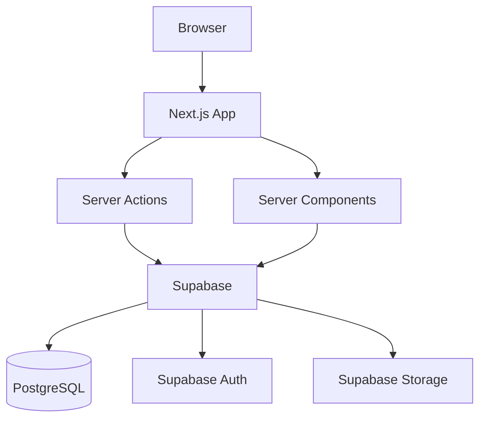

# Architecture — [Nom du projet]

## 1. Vue d'ensemble

<!-- Diagramme Mermaid haut niveau montrant les composants principaux
     et leurs interactions. Adapter au projet. -->



## 2. Stack technique

| Techno | Version | Rôle | Justification |
|--------|---------|------|---------------|
| Next.js | 15 (App Router) | Framework fullstack | SSR/SSG, Server Components, Server Actions |
| TypeScript | 5.x (strict) | Typage | Sécurité du code, autocomplétion |
| Supabase | Cloud | Backend-as-a-Service | Auth, DB PostgreSQL, RLS, Realtime, Storage |
| Tailwind CSS | 4.x | Styling | Utility-first, purge auto |
| Shadcn/ui | latest | Composants UI | Copy-paste, accessibles, Radix-based |
| Zod | 3.x | Validation | Schemas partagés front/back |
| React Hook Form | 7.x | Formulaires | Performance, intégration Zod |
| Vitest | latest | Tests unit/integ | Rapide, compatible ESM |
| Playwright | latest | Tests E2E | Cross-browser, fiable |
| pnpm | 9.x | Package manager | Rapide, strict |

<!-- PERSONNALISER : ajouter les libs spécifiques au projet -->

## 3. Structure du projet

```
src/
├── app/                          # Routes Next.js (App Router)
│   ├── (auth)/                   # Groupe : pages publiques (login, signup)
│   ├── (dashboard)/              # Groupe : pages authentifiées
│   ├── api/                      # Route handlers (webhooks uniquement)
│   ├── layout.tsx                # Root layout
│   └── not-found.tsx
├── components/
│   ├── ui/                       # Composants Shadcn/ui
│   ├── shared/                   # Composants métier réutilisables
│   └── [feature]/                # Composants spécifiques à une feature
├── hooks/                        # Custom hooks
├── lib/
│   ├── actions/                  # Server Actions (par domaine)
│   ├── schemas/                  # Zod schemas partagés
│   ├── supabase/                 # Clients Supabase (server.ts, client.ts)
│   └── utils/                    # Fonctions utilitaires pures
├── types/                        # Types TypeScript partagés
└── middleware.ts                  # Auth middleware Supabase
```

## 4. Modèle de données

<!-- Diagramme ER Mermaid. À remplir quand les entités sont définies. -->

```mermaid
erDiagram
    %% Exemple — adapter au projet :
    %% USERS ||--o{ PROJECTS : owns
    %% PROJECTS {
    %%     uuid id PK
    %%     uuid user_id FK
    %%     text name
    %%     timestamp created_at
    %% }
```

<!-- PERSONNALISER : définir les tables, relations, et contraintes.
     Chaque table doit avoir des RLS policies documentées. -->

### RLS Policies

<!-- Documenter les policies RLS pour chaque table :
| Table | Policy | Rôle | Règle |
|-------|--------|------|-------|
| projects | select | authenticated | user_id = auth.uid() |
| projects | insert | authenticated | user_id = auth.uid() |
-->

## 5. API Design

### Server Actions (mutations)

Chaque Server Action suit le pattern standard :
1. Vérifier l'auth (`supabase.auth.getUser()`)
2. Valider l'input (schema Zod)
3. Exécuter la mutation (Supabase)
4. Revalider le cache (`revalidatePath`)
5. Retourner `{ data }` ou `{ error }`

Voir `.tiple/conventions/api-patterns.md` pour les détails et exemples.

### Format de réponse standard

```typescript
type ActionResult<T> =
  | { data: T; error?: never }
  | { data?: never; error: string }
```

## 6. Auth & Sécurité

### Authentification
- **Provider** : Supabase Auth (email/password par défaut)
- **Session** : JWT stocké dans cookies httpOnly (via `@supabase/ssr`)
- **Refresh** : Automatique via le middleware Next.js

### Middleware (`src/middleware.ts`)
- Rafraîchit le token Supabase à chaque requête
- Redirige vers `/login` si non authentifié sur les routes protégées
- Exclut : `/login`, `/signup`, `/auth/callback`, assets statiques

### RLS (Row Level Security)
- Activé sur **toute** table sans exception
- Chaque table a au minimum une policy `SELECT` et `INSERT` pour `authenticated`
- Le `service_role` client est interdit sauf cas documenté (ADR obligatoire)

## 7. Infrastructure & Déploiement

<!-- PERSONNALISER : adapter au projet -->
- **Hébergement** : <!-- ex: Vercel, Coolify, Docker -->
- **Base de données** : Supabase Cloud (PostgreSQL)
- **Domaine** : <!-- ex: app.monprojet.com -->
- **Environnements** : dev (local) → staging → production

## 8. Invariants

Ces choix ne changent PAS sans ADR dans `docs/decisions/` :

- Next.js 15 App Router (pas Pages Router)
- TypeScript strict mode
- Supabase pour auth + DB + RLS
- Server Actions pour les mutations (pas d'API routes sauf webhooks)
- Zod pour toute validation (schemas partagés front/back)
- Migrations SQL versionnées dans `supabase/migrations/`
- Shadcn/ui comme base composants

## 9. Flexible

Ces choix peuvent être modifiés par projet sans ADR :

- Composants Shadcn installés
- Provider d'emails transactionnels
- Provider de paiement
- State management client (aucun par défaut)
- Stratégie de cache
- Déploiement (Vercel, Coolify, Docker...)
- Supabase Edge Functions
