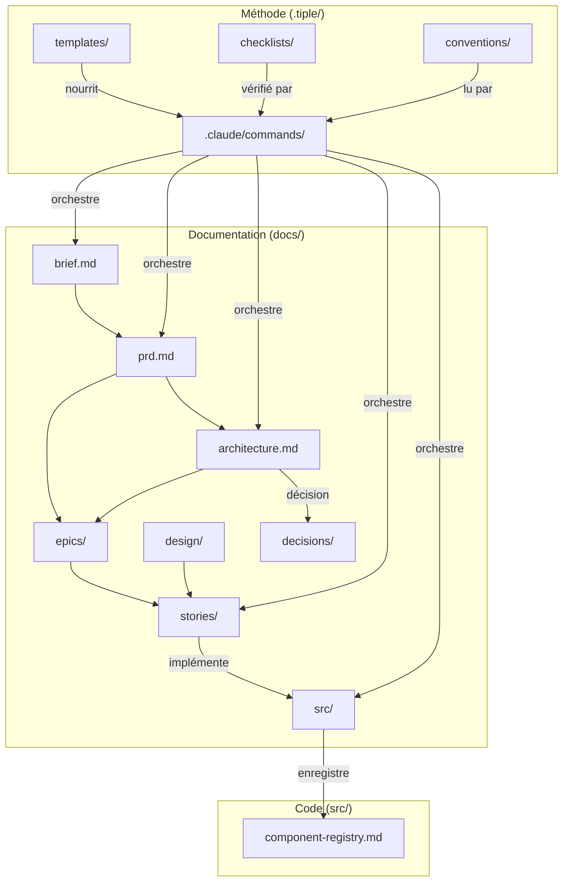

# Architecture — Tiple Method Template

> Architecture technique du template. Ce document accompagne le PRD.

---

## 1. Vue d'ensemble

Ce n'est pas une application — c'est un template Git. Il n'y a pas de backend à concevoir, pas d'API, pas de base de données. L'architecture porte sur :
1. La structure de fichiers et les conventions de nommage
2. Le scaffolding Next.js + Supabase (fichiers de config + code minimal fonctionnel)
3. Les slash commands Claude Code et comment elles interagissent avec les fichiers
4. Les dépendances entre documents



---

## 2. Stack technique

| Techno | Version | Rôle |
|--------|---------|------|
| Next.js | 15.x | Framework fullstack, App Router, Server Actions |
| React | 19.x | UI |
| TypeScript | 5.x | Typage strict |
| Supabase JS | 2.x | Client Supabase (auth, DB, storage) |
| @supabase/ssr | latest | Helpers SSR pour Next.js (cookies) |
| Tailwind CSS | 4.x | Styling utility-first |
| Shadcn/ui | latest | Composants UI (copy-paste, Radix-based) |
| Zod | 3.x | Validation schemas partagés |
| React Hook Form | 7.x | Gestion formulaires |
| @hookform/resolvers | latest | Bridge RHF ↔ Zod |
| clsx | latest | Conditional classnames |
| tailwind-merge | latest | Merge Tailwind classes sans conflit |
| Vitest | latest | Tests unit + integration |
| @testing-library/react | latest | Tests composants |
| @testing-library/jest-dom | latest | Matchers DOM |
| Playwright | latest | Tests E2E |
| pnpm | 9.x | Package manager |
| Supabase CLI | latest | Migrations, types, dev local |

---

## 3. Structure du projet

```
tiple-method-template/
│
├── CLAUDE.md                          # [FICHIER CLÉ] Instructions permanentes Claude Code
├── README.md                          # Guide d'utilisation du template
├── .gitignore                         # Adapté Next.js + Supabase + .tiple
├── .env.example                       # Variables requises avec commentaires
│
│── ─── MÉTHODE ──────────────────────
│
├── .claude/commands/                  # 12 slash commands tm-*
│   ├── tm-brief.md                    # Phase 1 : Brief interactif
│   ├── tm-prd.md                      # Phase 2 : PRD depuis brief
│   ├── tm-architecture.md             # Phase 3 : Architecture depuis PRD
│   ├── tm-design-system.md            # Phase 4 : Design system
│   ├── tm-gate.md                     # Gate : Readiness check
│   ├── tm-epic.md                     # Phase 5 : Créer une epic
│   ├── tm-story.md                    # Phase 5 : Créer une story
│   ├── tm-dev.md                      # Phase 6 : Implémenter une story
│   ├── tm-review.md                   # Phase 7 : Code review
│   ├── tm-evolve.md                   # Transversal : Évolution PRD
│   ├── tm-status.md                   # Sprint : Afficher le status
│   └── tm-sprint.md                   # Sprint : Nouveau sprint
│
├── .tiple/
│   ├── templates/                     # 6 templates de documents markdown
│   ├── checklists/                    # 5 checklists quality gates
│   ├── conventions/                   # 5 fichiers conventions pré-remplis
│   └── sprint/status.md              # Sprint tracking
│
├── docs/                              # Documentation vivante du projet
│   ├── brief.md                       # Stub → /tm-brief
│   ├── prd.md                         # Stub → /tm-prd
│   ├── architecture.md                # Stub → /tm-architecture
│   ├── changelog.md                   # Journal des évolutions
│   ├── design/                        # Maquettes, design system, user flows
│   ├── epics/                         # Epics détaillées
│   ├── stories/                       # Stories implémentables
│   └── decisions/                     # ADRs
│
│── ─── CODE ─────────────────────────
│
├── package.json                       # Dépendances + scripts
├── pnpm-lock.yaml
├── next.config.ts
├── tsconfig.json                      # strict: true, paths: {"@/*": ["./src/*"]}
├── tailwind.config.ts
├── postcss.config.js
├── vitest.config.ts                   # resolve alias @/, react plugin
├── playwright.config.ts               # baseURL localhost:3000
├── components.json                    # Shadcn/ui config
│
├── src/
│   ├── app/
│   │   ├── layout.tsx                 # Root: <html>, fonts, metadata, Providers
│   │   ├── page.tsx                   # Redirect → /login ou /dashboard
│   │   ├── not-found.tsx
│   │   ├── globals.css                # @import tailwind + CSS custom properties
│   │   ├── (auth)/layout.tsx          # Centré, pas de sidebar
│   │   └── (dashboard)/layout.tsx     # Sidebar + main content, auth guard
│   ├── components/ui/                 # Shadcn (vide au départ)
│   ├── hooks/.gitkeep
│   ├── lib/
│   │   ├── actions/.gitkeep
│   │   ├── schemas/.gitkeep
│   │   ├── supabase/client.ts         # createBrowserClient()
│   │   ├── supabase/server.ts         # createServerClient() avec cookies
│   │   └── utils/cn.ts               # clsx + twMerge
│   ├── types/
│   │   ├── database.ts                # Placeholder auto-généré
│   │   └── index.ts                   # Types métier
│   └── middleware.ts                   # Auth guard + token refresh
│
├── supabase/
│   ├── config.toml                    # Config Supabase local
│   ├── migrations/.gitkeep
│   └── seed.sql                       # Template seed (commenté)
│
└── tests/
    ├── unit/.gitkeep
    ├── integration/.gitkeep
    └── e2e/.gitkeep
```

---

## 4. Fichiers de code critiques (contenu attendu)

### 4.1 — `src/middleware.ts`

Doit être **fonctionnel dès le clone**. Responsabilités :
- Rafraîchir le token Supabase à chaque requête (via `updateSession`)
- Rediriger vers `/login` si non authentifié sur les routes protégées
- Laisser passer les routes publiques (`/login`, `/signup`, `/auth/callback`, assets statiques)

Pattern : utiliser `@supabase/ssr` `createServerClient` avec les cookies Next.js.

Matcher config : exclure `_next/static`, `_next/image`, `favicon.ico`, les fichiers statiques.

### 4.2 — `src/lib/supabase/server.ts`

Crée le client Supabase côté serveur avec gestion des cookies Next.js :
- Utilise `cookies()` de `next/headers`
- Passe les méthodes `getAll` et `setAll` au `createServerClient` de `@supabase/ssr`
- Exporté comme `createClient()` (async, car `cookies()` est async en Next.js 15)

### 4.3 — `src/lib/supabase/client.ts`

Crée le client Supabase côté navigateur :
- Utilise `createBrowserClient` de `@supabase/ssr`
- Exporté comme `createClient()`
- Usage : realtime, auth listener, storage upload uniquement

### 4.4 — `src/app/layout.tsx`

Root layout minimal :
- `<html lang="fr">` 
- Import de la font (Inter via `next/font/google`)
- Import de `globals.css`
- Metadata de base (title template, description placeholder)
- `{children}` sans providers complexes (ajoutés par projet)

### 4.5 — `src/app/(auth)/layout.tsx`

Layout centré pour les pages d'auth :
- Flexbox centré verticalement et horizontalement
- Max-width pour le contenu (ex: `max-w-md`)
- Fond neutre

### 4.6 — `src/app/(dashboard)/layout.tsx`

Layout authentifié :
- Vérifie la session Supabase (server-side)
- Redirige vers `/login` si pas de session
- Structure : sidebar (desktop) + main content
- Placeholder pour la sidebar et le header (à implémenter par projet)

### 4.7 — `src/lib/utils/cn.ts`

```typescript
import { type ClassValue, clsx } from "clsx"
import { twMerge } from "tailwind-merge"

export function cn(...inputs: ClassValue[]) {
  return twMerge(clsx(inputs))
}
```

### 4.8 — `src/app/globals.css`

```css
@import "tailwindcss";

/* CSS custom properties pour le design system — à personnaliser par projet */
:root {
  --background: 0 0% 100%;
  --foreground: 0 0% 3.9%;
  /* ... variables Shadcn/ui standard */
}
```

### 4.9 — `.env.example`

```bash
# ============================================
# Supabase — Récupérer depuis le dashboard Supabase
# ============================================
NEXT_PUBLIC_SUPABASE_URL=https://your-project.supabase.co
NEXT_PUBLIC_SUPABASE_ANON_KEY=your-anon-key

# Service role — JAMAIS exposé côté client
SUPABASE_SERVICE_ROLE_KEY=your-service-role-key

# ============================================
# App
# ============================================
NEXT_PUBLIC_APP_URL=http://localhost:3000

# ============================================
# Supabase CLI (pour db:types)
# ============================================
SUPABASE_PROJECT_ID=your-project-id
```

### 4.10 — `supabase/seed.sql`

```sql
-- Seed data pour développement local
-- Lancer avec : npx supabase db reset (applique migrations + seed)
--
-- Exemple :
-- INSERT INTO public.profiles (id, email, full_name)
-- VALUES 
--   ('00000000-0000-0000-0000-000000000001', 'dev@test.com', 'Dev User');
--
-- IMPORTANT : les UUIDs doivent correspondre aux users créés dans Supabase Auth
-- Pour créer un user de test : utiliser le dashboard Supabase ou un script séparé
```

---

## 5. Slash Commands — Architecture interne

Chaque fichier `.claude/commands/tm-*.md` est un markdown qui contient :
1. Un titre (nom de la commande)
2. Un input attendu (argument ou "next"/"last")
3. Un process étape par étape (quels fichiers lire, quoi produire, quels fichiers mettre à jour)

Les commandes ne sont PAS du code exécutable. Ce sont des instructions que Claude Code interprète. Elles ne doivent jamais dépasser ~100 lignes pour rester dans le contexte.

### Dépendances entre commandes

```
/tm-brief → produit docs/brief.md
    ↓
/tm-prd → lit brief.md, produit docs/prd.md
    ↓
/tm-architecture → lit prd.md, produit docs/architecture.md
    ↓
/tm-design-system → produit docs/design/system.md
    ↓
/tm-gate → vérifie que tout est prêt (readiness-gate checklist)
    ↓
/tm-epic → lit prd.md + architecture.md, produit docs/epics/E0X-*.md
    ↓
/tm-story → lit epic + architecture + conventions, produit docs/stories/E0X-S0X-*.md
    ↓
/tm-dev → lit story + design + architecture + conventions + registry, produit du code dans src/
    ↓
/tm-review → lit story + code produit + checklists, produit un rapport + fixes
    ↓
/tm-status → met à jour .tiple/sprint/status.md
```

Commandes transversales (à tout moment) :
- `/tm-evolve` → modifie docs/prd.md + cascade vers architecture/epics/stories
- `/tm-sprint` → initialise un nouveau sprint dans .tiple/sprint/status.md

---

## 6. Invariants

Ces choix ne changent JAMAIS dans le template (un projet client peut les modifier via ADR) :
- Next.js 15 App Router (pas Pages Router)
- TypeScript strict mode
- Supabase pour auth + DB + RLS
- Server Actions pour les mutations (pas d'API routes sauf webhooks)
- Zod pour toute validation (schemas partagés front/back)
- Vitest + Testing Library pour unit/integ, Playwright pour e2e
- pnpm comme package manager
- Migrations SQL versionnées dans `supabase/migrations/`
- Shadcn/ui comme base composants (copy-paste, pas de lib monolithique)

## 7. Flexible

Ces choix peuvent être modifiés par projet sans ADR :
- Composants Shadcn installés (chaque projet installe ce dont il a besoin)
- Provider d'emails transactionnels
- Provider de paiement
- Librairie de state management client (aucune par défaut, @tanstack/query si besoin)
- Stratégie de cache (revalidate, tags, etc.)
- Déploiement (Vercel, Coolify, Docker...)
- Supabase Edge Functions (ajoutées par projet)
